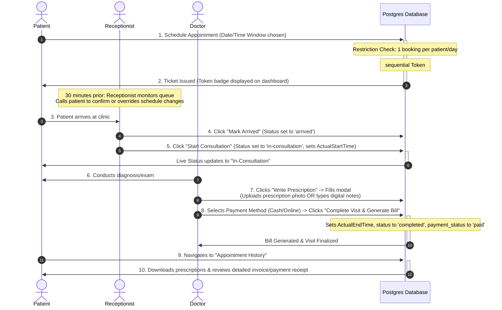

# Thakur Dental Clinic: Master Implementation Guide (End-to-End)

This document serves as the definitive technical and functional guide for building the clinic management system. It covers everything from authentication and booking to the final record management.

> [!IMPORTANT]
> **ABDM Note**: Active integration with ABDM/ABHA is currently paused. Placeholders are included in the architecture to allow for seamless integration once certification is obtained.

---

## 1. System Architecture & Authentication

Our platform uses a unified authentication layer.

### **Authentication Logic**
*   **Identity Provider (IdP)**:
    1.  **Email/Phone/Password**: Standard login for staff and patients.
        *   **Patients**: Can sign up and log in using either Email, Phone number, or both. At least one contact method is required.
        *   **Staff**: Admin doctors can register doctors or receptionists. For all staff members, both Email and Phone number are strictly required.
    2.  **Google OAuth**: Social login for quick patient access.
    3.  **[PLACEHOLDER] ABHA Login**: Future integration point for Login via ABHA Address/Number + OTP.
*   **The JWT Token**: Regardless of the login method, the backend issues a standard **JWT (JSON Web Token)**. This token contains the `UserID` and `UserType` (Patient, Doctor, or Receptionist).
*   **Security**: All endpoints (except public blogs) are protected by an `AuthMiddleware`.

---

## 2. Patient Onboarding & ABHA Integration (Future Phase)

### **[PLACEHOLDER] Scenario A: Digital-First Patient (ABHA)**
- **Integration Point**: UI for ABHA ID entry and OTP verification.
- **Backend Logic**: Auto-populating local `Users` table from ABDM fetched data.

### **Scenario B: Traditional Patient (Manual)**
1.  **Flow**: Patient registers via Email/Phone.
2.  **Registration**: Standard form submission to `/api/auth/signup`.
3.  **[PLACEHOLDER] ABHA Linkage**: Future "Link ABHA" button on the dashboard to upgrade account.

---

## 3. The Detailed Appointment Lifecycle

### **End-to-End User Journey Diagram**



### **Step 1: Booking (Patient)**
*   **Action**: Patient chooses a **Time Slot** (e.g., Morning/Evening). They do **not** choose a doctor.
*   **Daily Limit**: Only **one appointment per day** is allowed.
*   **Logic**: System assigns a **Token Number** and a **Rough Estimated Time** (35-40 mins default).
*   **Visibility**: Token Number is visible on both Patient and Receptionist dashboards.

### **Step 2: Pre-Appointment Notification & Calling**
*   **Action**: 30 minutes before the estimated time, the system sends a notification to the patient.
*   **Receptionist Dashboard**: These details are also visible to the Receptionist. 
*   **Receptionist Task**: The Receptionist uses this view to identify patients who need a courtesy call to confirm they are on their way.

### **Step 3: Dynamic Queue Adjustments (Preponement/Postponement)**
*   **Postponement**: If a visit runs long, tokens shift forward.
*   **Logic**: Patients receive a dashboard notification. They can either **Accept** the new timings or **Cancel** the appointment.
*   **Preponement**: If an earlier slot opens up, the next patient is notified.
*   **Receptionist Action**: 
    1.  The Receptionist sees these adjustment alerts on their dashboard.
    2.  They call the patient to discuss the change.
    3.  **Manual Override**: The Receptionist can mark the patient's decision (Accept/Cancel) directly from their dashboard on behalf of the patient.

### **Step 4: Arrival & Start (Receptionist)**
*   **Arrival**: Receptionist marks patient as "Arrived".
*   **Start**: Receptionist marks when the appointment starts. Patient dashboard updates to "In-Consultation".

### **Step 5: Consultation & Doctor Assignment (Doctor)**
*   **Assignment**: Appointment assigned to the **available doctor**. 
*   **Admin Override**: Admin doctors can manually reassign an appointment from one doctor to another. This can be done **both before and after** a doctor has been initially assigned to the patient.
*   **Leave Management**: Doctors on leave are excluded from assignment.
*   **Records**: Doctor creates the prescription. Doctors can monitor other doctors' patient history for continuity.

---

## 4. Completion & Patient Records

### **Step 6: Payment & Completion**
1.  **Payment Collection**: Collected off-line at checkout. Marked as **Paid** by the consulting doctor or clinic staff.
    *   **Cash**: Cash collected in-person.
    *   **Online**: UPI QR code scan or card swipe terminal.
2.  **Completion**: The doctor submits the digital or manual prescription, sets the payment method, and clicks **"Complete Visit & Generate Bill"**. The database sets the status to `completed`, `payment_status` to `paid`, and captures `actual_end_time` and `notes`.

### **Step 7: Internal Patient Dashboard (Medical History)**
Patients can view their full history:
*   **Records**: View digital diagnosis notes (digital prescription notes) or download manual scans.
*   **Doctor Info**: Details of the consulting doctor who provided the diagnosis.
*   **Payment History & Receipt**: A detailed **Invoice & Receipt Summary** displaying:
    *   Consultation fee breakdown (Flat ₹500.00).
    *   Payment Status (Paid badge) and Payment Method (Cash or Online).
    *   Completion Timestamp and Reference ID (`REC-[AppointmentID]`).
    *   One-click **Print Receipt** action to generate a print/PDF export.

### **Step 8: [PLACEHOLDER] ABDM Health Record Sync**
- **Future Integration**: Logic to convert records to **FHIR bundles** and link them to the national ABHA vault.

---

## 5. Detailed Implementation Checklist

| Phase | Component | Task |
| :--- | :--- | :--- |
| Phase 1 | Database | Add `queue_number`, `payment_status`, `is_on_leave`, and ABDM placeholders. |
| Phase 2 | Auth | Refine existing Email/Google Auth; add ABHA UI placeholders. |
| Phase 3 | Queue Logic| Build the "Shift" logic and **Receptionist Manual Override** features. |
| Phase 4 | Dashboards | Build the Receptionist "Call List" and "Status Control" views. |
| Phase 5 | Clinical | Implement Digital Scribble tool and Doctor Assignment/Override logic. |
| Phase 6 | History | Build the Patient History view with detailed medical and payment logs. |

---

## 6. Technical Implementation Details (Detailed Reference)

This section documents the exact technical changes made to the codebase to support the end-to-end booking workflow.

### **A. Database & Models (`backend/internal/models`)**
*   **`Appointment` Model**:
    *   `QueueNumber` (int): Daily token number assigned to the patient.
    *   `EstimatedStartTime` (time.Time): Dynamically calculated based on the previous patient's slot.
    *   `ActualStartTime` (time.Time): Set when the Receptionist clicks "Start Consult".
    *   `ActualEndTime` (time.Time): Set when the Doctor clicks "Complete Visit".
    *   `Status`: Expanded to include `arrived` and `in-consultation`.
    *   `PaymentStatus`: Tracks `pending` vs `paid`.
    *   `PaymentMethod`: Records `cash` or `online`.
    *   `PrescriptionType`: Distinguishes between `manual` (photo) and `digital` (notes).
    *   `PrescriptionURLs`: JSON string array storing paths to uploaded images.
*   **`User` Model**:
    *   `Email` (*string): User's email address, stored as a nullable pointer. Required for staff; optional for patients. Standard unique index applies to non-nil values.
    *   `Phone` (*string): User's phone number, stored as a nullable pointer. Required for staff; optional for patients. Standard unique index applies to non-nil values.
    *   `MiddleName` (string): Optional middle name. Populated manually or parsed from Google OAuth display names via split-name parsing.
    *   `IsActive` (bool): Activation toggle. If set to `false`, the staff member is locked out of logins and hidden from booking panels, preserving relational logs.
    *   `IsOnLeave` (bool): If true, doctor is excluded from booking availability.
    *   `Specialization` (string): Doctor's field of expertise.
    *   `AbhaID` (string): Placeholder for ABDM integration.

### **B. API Endpoints (`backend/internal/handlers`)**
*   `POST /api/appointments`:
    *   **Logic**: Validates that the patient has no other booking today. Finds the last token of the day, increments it, and adds 35 minutes to the previous estimation.
*   `PUT /api/appointments/:id/arrived`:
    *   **Logic**: Updates status to `arrived`. Used by Receptionist for check-in.
*   `PUT /api/appointments/:id/start`:
    *   **Logic**: Updates status to `in-consultation` and sets `ActualStartTime`.
*   `PUT /api/appointments/:id/complete`:
    *   **Logic**: Sets `ActualEndTime`, updates prescription data (`PrescriptionURLs` or digital `Notes`), sets `PaymentStatus` to `paid`, and records the `PaymentMethod`. All four fields (`prescriptionUrls`, `prescriptionType`, `paymentMethod`, and `notes`) are bound from the request JSON payload.
*   `PUT /api/users/:id`:
    *   **Logic**: Updates user profile. Admin doctors can update `IsActive` to toggle account status.
*   `GET /api/users`:
    *   **Logic**: Filters users by `userType` and `isActive` query parameters to return active doctors for patients.

### **C. Frontend Components (`frontend/src/components` & `pages`)**
*   **`AppointmentList.tsx`**:
    *   Shared component that adapts based on the logged-in user's role.
    *   **Receptionist View**: Shows "Mark Arrived" and "Start Consult" buttons for upcoming tokens.
    *   **Doctor View**: Shows "Write Prescription" for the active patient in consultation.
    *   **Patient View**: Shows their assigned token and estimated time in a prominent blue badge.
*   **`CompletionModal.tsx`**:
    *   Multi-step tool for doctors to finalize visits.
    *   Supports image uploads via `FileUpload.tsx` for manual prescriptions.
    *   Supports text entry for digital prescriptions (which are saved directly to the database).
    *   One-click payment method selection.
*   **`PrescriptionModal.tsx`**:
    *   Renders patient history records.
    *   Displays digital prescription notes in a dedicated diagnosis card.
    *   Renders a premium **Invoice & Receipt Summary** card for completed visits with a flat fee structure, payment method, payment status, and a **"Print Receipt"** option.
*   **`AdminDashboard.tsx`**:
    *   Allows deactivating or reactivating staff accounts via the Actions column.
    *   Provides an optional Middle Name field in the Create Staff modal.
*   **`ProfileCard.tsx` & `LoginPage.tsx`**:
    *   Display and modify First, Middle, and Last name fields. Render names cleanly, filtering out extra spacing when the middle name is empty.
    *   LoginPage supports logging in using either email or phone number.
    *   Registration/Signup allows patients to sign up using only phone, only email, or both.
    *   ProfileCard allows patients to edit email and phone, enforcing that at least one is present. For staff members, editing enforces that both email and phone are present.
    *   LoginPage contains visual red asterisks (`*`) for all required fields in patient and staff modes.
    *   LoginPage maps API response errors to individual fields (e.g. duplicate email conflicts map to Email, duplicate phone to Phone, invalid credentials to both Email/Phone and Password) to render inline red highlights and messages uniformly.

---

## 7. How to Test (Full Flow Guide)

Follow these steps to verify the end-to-end implementation:

### **1. Patient Flow**
*   **Action**: Log in as a patient and click **"Schedule Appointment"**.
*   **Verification**: Check that you are assigned a **Token Number** and an **Estimated Time**.
*   **Logic Check**: Try to book again; the system should block the second attempt for the same day.

### **2. Receptionist Flow**
*   **Action**: Log in as a Receptionist.
*   **Action**: Find the patient in "Today's Queue".
*   **Check-in**: Click **"Mark Arrived"**.
*   **Consultation**: Click **"Start Consultation"**.

### **3. Doctor Flow**
*   **Action**: Log in as a Doctor.
*   **Action**: The patient will appear with a **"Write Prescription"** button.
*   **Scribe**: Click the button, upload a photo or type digital prescription notes, and select "Cash" payment.
*   **Complete**: Click **"Complete Visit & Generate Bill"**.

### **4. History Flow**
*   **Action**: Log in as the Patient again.
*   **Verification**: The appointment now appears in **"Appointment History"**. Click **"View Records"** to verify:
    - The digital prescription notes appear in the diagnosis section.
    - The detailed **Invoice & Receipt Summary** card renders correctly (showing reference ID, ₹500 fee, Paid status, Cash/Online method, timestamp).
    - The **"Print Receipt"** button works.

---

## 8. Current Implementation Status (Implemented vs. Pending)

This section maps what features described in the workflow are currently active in the codebase and which ones are pending implementation (excluding the ABDM/ABHA health record integrations).

### **A. Implemented Features**
*   **Dual Sign-On Mechanisms**: Patients can sign up manually (with First, Middle, and Last name) or instantly via Google OAuth. Google profile names are parsed and split into first, middle, and last names.
*   **Administrative Access**: Staff and doctors log in using pre-configured database credentials.
*   **Symmetric Queue Tokening**: Booking an appointment calculates a daily token sequence (`#1`, `#2`, etc.) and a static `EstimatedStartTime` (+35 mins increment per token).
*   **Booking Restriction**: The system blocks users from booking more than one appointment per day.
*   **Check-In Flow Control**: Receptionists can mark patients as `Arrived` and check them into rooms via `Start Consultation`.
*   **Clinical Scribing Modal**: Doctors can complete visits by uploading manual prescription scans (photos) or typing structured digital diagnostics.
*   **Bookkeeping & Billing Logs**: Doctor/Staff logs whether the patient paid via `Cash` or `Online`, updating the appointment database row status to `completed` and `paid`.
*   **Relational Patient Logbook**: Patients can view historic logs, including diagnoses, download scripts, and view billing methods.
*   **Staff Profile & Activation Toggles**: Admin Doctor can add, update, deactivate, and reactivate doctors/receptionists from the Admin Panel. Inactive staff are barred from logging in and filtered out of active dropdowns while preserving clinical audit records.
*   **Dynamic Queue Timings Shifting**: Automatically calculates later patient estimated arrival times dynamically if a preceding consultation runs long (exceeds default 35-minute slot).
*   **Live Queue Notifications (SSE)**: Pushes real-time SSE events to patients immediately when their estimated start time shifts, or when their assigned doctor is changed.
*   **Receptionist Dynamic Override Switch**: Receptionists/Doctors can manually delay slots (+15m, +30m) directly from active queue cards, which propagates down the daily list.
*   **Pre-Arrival Timing Reminders**: A background cron goroutine checks every 2 minutes for scheduled appointments starting within 30 minutes, flags `ReminderSent = true`, logs reminder dispatches to the container stdout, and sends a live SSE alert.
*   **Receptionist Call List Prompts**: A dedicated "Pre-Arrival Call List" tab on the Receptionist Dashboard helps receptionist review upcoming patients (starting within 45 minutes) and log courtesy arrival calls.
*   **Admin Doctor Reassignment Controls**: Admin Doctors can dynamically reassign the patient's consulting doctor using a selector dropdown built directly on active queue list cards.

### **B. Pending Features (Not Yet Implemented)**
*   *None* (excluding the certification-dependent ABDM/ABHA health record integrations which remain paused).

---

## 9. Technical Architecture of Queue & Override Features

This section documents the technical details of the queue shifting, real-time SSE notifications, cron reminders, receptionist controls, and admin reassignments.

### **1. Database Schema Additions (`backend/internal/models/appointment.go`)**
The GORM model schema for appointments tracks reminder and timing adjust status:
```go
ReminderSent  bool `gorm:"default:false" json:"reminderSent"`
ShiftAccepted bool `gorm:"default:true" json:"shiftAccepted"`
```

### **2. Dynamic Queue Shift Propagation (`backend/internal/services/appointment_service.go`)**
When a consultation finishes and exceeds the default 35-minute slot, or when a receptionist manually delays an appointment:
1.  `PropagateQueueShift(appID uuid.UUID, delayMinutes int) error` is triggered.
2.  It queries subsequent scheduled/arrived appointments for today:
    ```go
    func (r *AppointmentRepository) GetSubsequentAppointmentsForDoctorToday(doctorID uuid.UUID, queueNumber int) ([]models.Appointment, error)
    ```
3.  For each subsequent appointment, `EstimatedStartTime` is pushed by `delayMinutes` and `ShiftAccepted` is set to `false`.
4.  An SSE notification is dispatched to each affected patient.

### **3. Live Stream Gateway (SSE) (`backend/internal/handlers/sse.go`)**
*   **Endpoint**: Exposes `/api/auth/stream?token=...` which supports authenticating via URL query token params (overcoming browser EventSource header restrictions).
*   **Channel Registry**: Manages a thread-safe map `clients = make(map[string][]chan string)` to push notifications to active patient sessions.
*   **Notifications Hook**: `services.NotifyFunc` is wired in `main.go` to invoke `handlers.SendNotification`, eliminating circular go imports.

### **4. Pre-Arrival Reminder Ticker (`backend/internal/cron/reminder_worker.go`)**
*   **Worker**: Boots on server startup, running a loop check every 2 minutes.
*   **Logic**: Queries appointments where `status = 'scheduled' AND estimated_start_time <= (now + 30 mins) AND reminder_sent = false`.
*   **Action**: Updates the DB row (`ReminderSent = true`), logs reminder printout to the container console, and broadcasts an SSE notification to the patient.

### **5. Frontend SSE Client & Banners (`frontend/src/components/common/SSEClient.tsx`)**
*   **SSE Client**: Embedded globally in `Layout.tsx`. Subscribes to `/api/auth/stream` when the user session is active.
*   **Banners**: If the active user is a Patient and `appointment.shiftAccepted === false`, a warning banner is rendered on the patient dashboard indicating delay times, prompting them to click **"Accept Shift"** (updating DB to `shiftAccepted = true`).
*   **Reactive Reloads**: Dispatches a custom window event `refreshAppointments` which triggers an instant refetch on all active dashboards.

### **6. Receptionist Call List & Timing Overrides**
*   **Call Panel**: Built as a dedicated tab on `ReceptionistDashboard.tsx`.
*   **Courtesy Dial**: Filters patients starting within 45 minutes who haven't checked in, providing a call confirmation checkmark log.
*   **Manual Delay Buttons**: Renders `+15m` / `+30m` actions on queue rows. Clicking them issues a `PUT /api/appointments/:id/delay` request which triggers queue shifts.

### **7. Admin Doctor Reassignment Dropdowns**
*   **Endpoint**: `PUT /api/appointments/:id/reassign` (secured by `RequireAdmin()` middleware).
*   **UI Controls**: If the logged-in doctor is an Admin, a doctor selection dropdown is rendered on active queue items, pulling active staff lists from `GET /api/users?userType=doctor&isActive=true`. Choosing a doctor updates the assignment dynamically.

---

## 10. Password Recovery Workflow (Forgot & Reset Password)

Our platform implements a highly secure, single-use password recovery mechanism.

### **Recovery Logic**
1. **Request Link**: 
   - A user (Patient, Doctor, or Receptionist) clicks the "Forgot Password?" link on the login page.
   - They enter their registered Email Address or Phone Number.
   - The backend searches for a matching user. If found, a secure, cryptographically random, single-use reset token is generated.
   - The token and its expiration time (set to 15 minutes in the future) are saved to the database:
     - `PasswordResetToken` (string)
     - `PasswordResetTokenExpiresAt` (time.Time)
2. **Dispatch Link**:
   - The backend sends a recovery link (`/reset-password?token=<token>`) via the configured communication channels:
     - **Email**: Sent using standard SMTP parameters (configured via `.env` variables `SMTP_HOST`, `SMTP_PORT`, `SMTP_USERNAME`, `SMTP_PASSWORD`, `SMTP_FROM`).
     - **SMS**: Mocked to the server console in development/testing (containing the exact link to allow local testing and validation).
     - **Dual Delivery**: If the user has both Email and Phone number registered in their account, the link is sent to both channels simultaneously.
3. **Link Validation**:
   - When the user visits `/reset-password?token=...`, the frontend automatically issues a validation request to the backend `/api/auth/verify-reset-token` before rendering the form.
   - If the token is invalid, expired, or has already been used, the user is presented with a clear error screen and a link to request a new recovery link.
4. **Password Reset**:
   - Upon submitting a new password (validated to be at least 8 characters), the frontend calls `/api/auth/reset-password`.
   - The backend updates the user's password hash and immediately clears the token columns (`PasswordResetToken` and `PasswordResetTokenExpiresAt` set to `nil`), disabling the link forever.
   - The user is shown a success screen and can return to the login page to sign in with their new credentials.


